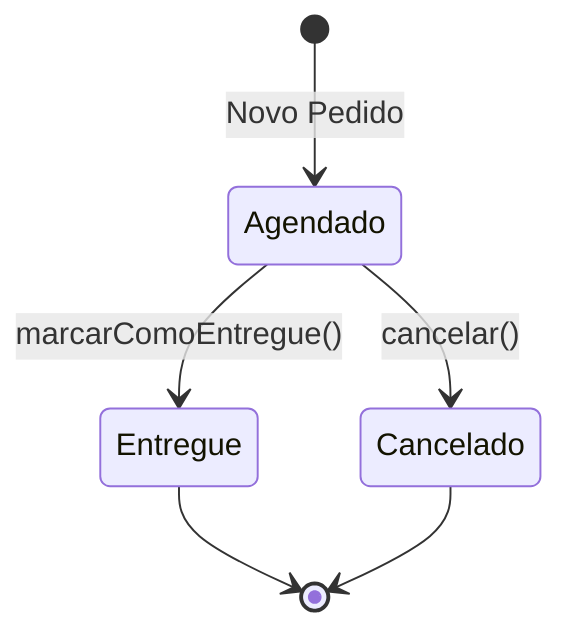
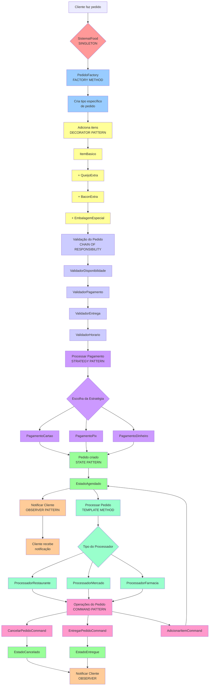

# Atividade-10

### Autores

- **Luis Gustavo**
- **Mayara Mikaelly**

### Propósito Educacional

Este projeto é uma implementação acadêmica que demonstra um sistema simplificado inspirado no iFood, desenvolvido como parte da disciplina de Arquitetura de Projetos. 
O sistema serve como exemplo prático da aplicação dos seguintes padrões de projeto:

- **Singleton**: Gerenciamento centralizado do sistema
- **Factory Method**: Criação flexível de diferentes tipos de pedidos
- **State**: Controle das transições de estado dos pedidos
- **Observer**: Notificação automática de mudanças aos clientes
- **Strategy** e **Decorator**: adicionam flexibilidade ao sistema 
- **Command**: permite operações reversíveis e histórico 
- **Template Method**: padroniza processos mantendo customização
- **Chain of Responsibility**: organiza validações complexas

Este projeto foi desenvolvido totalmente com fins acadêmicos para demonstrar o entendimento e aplicação prática de padrões de projeto em um cenário real, permitindo uma melhor compreensão de como diferentes padrões podem trabalhar em conjunto para criar uma solução robusta e flexível.

---

## 1. Singleton Pattern 🏢

Classe: SistemaIFood
Propósito: Garantir uma única instância do sistema central
Benefício: Controle centralizado de todos os pedidos e operações

## 2. Factory Method Pattern 🏭

Classes: PedidoFactory, PedidoRestauranteFactory, PedidoMercadoFactory, PedidoFarmaciaFactory
Propósito: Criar diferentes tipos de pedidos sem especificar classes concretas
Benefício: Facilita extensão para novos tipos de estabelecimentos

## 3. State Pattern 🔄

Classes: PedidoState, EstadoAgendado, EstadoEntregue, EstadoCancelado
Propósito: Gerenciar mudanças de comportamento baseadas no estado do pedido
Benefício: Transições controladas e comportamentos específicos por estado

## 4. Observer Pattern 👁️

Classes: Cliente (Observer), Pedido (Observable)
Propósito: Notificar clientes automaticamente sobre mudanças no pedido
Benefício: Comunicação desacoplada e automática

## 5. Strategy Pattern 💳

Classes: PagamentoStrategy, PagamentoCartao, PagamentoPix, PagamentoDinheiro
Propósito: Alternar entre diferentes algoritmos de pagamento
Benefício: Flexibilidade para adicionar novos métodos de pagamento

## 6. Decorator Pattern 🎁

Classes: ItemPedido, ComplementoDecorator, QueijoExtra, BaconExtra, EmbalagemEspecial
Propósito: Adicionar funcionalidades aos itens dinamicamente
Benefício: Combinações flexíveis de complementos sem explosão de classes

## 7. Command Pattern ⚡

Classes: Command, CancelarPedidoCommand, EntregarPedidoCommand, GerenciadorComandos
Propósito: Encapsular operações como objetos, permitindo undo/redo
Benefício: Histórico de operações e capacidade de reverter ações

## 8. Template Method Pattern 📋

Classes: ProcessadorPedido, ProcessadorRestaurante, ProcessadorFarmacia, ProcessadorMercado
Propósito: Definir esqueleto do algoritmo, permitindo variações em subclasses
Benefício: Código reutilizável com pontos de customização específicos

## 9. Chain of Responsibility Pattern 🔗

Classes: ValidadorPedido, ValidadorDisponibilidade, ValidadorPagamento, ValidadorEntrega
Propósito: Processar requisições através de uma cadeia de handlers
Benefício: Validações modulares e extensíveis

## Fluxo de funcionamento

O sistema implementa um fluxo de pedidos com as seguintes etapas:

1. **Criação do Pedido**
    - Obtém instância única do `SistemaIFood`
    - Utiliza factory específica para criar o tipo de pedido
    - Associa o pedido a um cliente

2. **Gerenciamento de Estado**
   - Pedido inicia sem estado definido
   - Agendamento define data e hora futura
   - Preparação específica por tipo:
     - Restaurante: Gerencia observações da cozinha
     - Mercado: Controla necessidade de embalagem especial
     - Farmácia: Valida receitas médicas quando necessário

3. **Transições de Estado**
   - SemEstado → Agendado (via `agendar()`)
   - Agendado → Entregue (via `marcarComoEntregue()`)
   - Agendado → Cancelado (via `cancelar()`)
   - Cliente é notificado automaticamente das mudanças

4. **Finalização**
   - Estados finais: Entregue ou Cancelado
   - Sistema mantém histórico dos pedidos
   - Não permite transições após estados finais

## Diagrama de Classe do Projeto

```mermaid
classDiagram
    %% ==================== SINGLETON ====================
    class SistemaIFood {
        -static instance: SistemaIFood
        -pedidos: List~Pedido~
        -SistemaIFood()
        +getInstance() SistemaIFood
        +criarPedido(factory, cliente) Pedido
        +validarPedido(pedido) boolean
    }
    
    %% ==================== FACTORY METHOD ====================
    class PedidoFactory {
        <<interface>>
        +criarPedido(id, cliente) Pedido
    }
    
    class PedidoRestauranteFactory {
        +criarPedido(id, cliente) PedidoRestaurante
    }
    
    class PedidoMercadoFactory {
        +criarPedido(id, cliente) PedidoMercado
    }
    
    class PedidoFarmaciaFactory {
        +criarPedido(id, cliente) PedidoFarmacia
    }
    
    %% ==================== PEDIDOS (BASE) ====================
    class Pedido {
        <<abstract>>
        #id: int
        #cliente: Cliente
        #estado: PedidoState
        #itens: List~ItemPedido~
        #valorTotal: double
        #processador: ProcessadorPedido
        #pagamento: ProcessadorPagamento
        +setEstado(estado)
        +getEstado() PedidoState
        +processar()
        +preparar()*
        +agendar()
        +cancelar()
        +marcarComoEntregue()
        +adicionarItem(item)
        +removerItem(item)
        +getValorTotal() double
        +getId() int
        +getCliente() Cliente
    }
    
    class PedidoRestaurante {
        +preparar()
        +temObservacoesCozinha() boolean
    }
    
    class PedidoMercado {
        +preparar()
        +precisaEmbalagemEspecial() boolean
    }
    
    class PedidoFarmacia {
        +preparar()
        +validarReceitas() boolean
    }
    
    %% ==================== STATE PATTERN ====================
    class PedidoState {
        <<interface>>
        +processarPedido(pedido)
        +getNomeEstado() String
    }
    
    class EstadoAgendado {
        +processarPedido(pedido)
        +getNomeEstado() String
    }
    
    class EstadoCancelado {
        +processarPedido(pedido)
        +getNomeEstado() String
    }
    
    class EstadoEntregue {
        +processarPedido(pedido)
        +getNomeEstado() String
    }
    
    %% ==================== OBSERVER PATTERN ====================
    class Cliente {
        -nome: String
        -endereco: String
        -telefone: String
        +update(Observable, Object)
        +cancelarPedido(pedido)
        +entregarPedido(pedido)
        +getNome() String
        +getEndereco() String
    }
    
    %% ==================== STRATEGY PATTERN ====================
    class PagamentoStrategy {
        <<interface>>
        +processarPagamento(valor) boolean
        +getTipoPagamento() String
    }
    
    class PagamentoCartao {
        -numeroCartao: String
        +processarPagamento(valor) boolean
        +getTipoPagamento() String
    }
    
    class PagamentoPix {
        -chavePix: String
        +processarPagamento(valor) boolean
        +getTipoPagamento() String
    }
    
    class PagamentoDinheiro {
        +processarPagamento(valor) boolean
        +getTipoPagamento() String
    }
    
    class ProcessadorPagamento {
        -strategy: PagamentoStrategy
        +setStrategy(strategy)
        +processarPagamento(valor) boolean
    }
    
    %% ==================== DECORATOR PATTERN ====================
    class ItemPedido {
        <<abstract>>
        #descricao: String
        +getDescricao() String
        +getPreco() double
    }
    
    class ItemBasico {
        -preco: double
        +getDescricao() String
        +getPreco() double
    }
    
    class ComplementoDecorator {
        <<abstract>>
        #item: ItemPedido
        +ComplementoDecorator(item)
        +getDescricao() String
        +getPreco() double
    }
    
    class QueijoExtra {
        +getDescricao() String
        +getPreco() double
    }
    
    class BaconExtra {
        +getDescricao() String
        +getPreco() double
    }
    
    class EmbalagemEspecial {
        +getDescricao() String
        +getPreco() double
    }
    
    %% ==================== COMMAND PATTERN ====================
    class Command {
        <<interface>>
        +execute()
        +undo()
    }
    
    class CancelarPedidoCommand {
        -pedido: Pedido
        -estadoAnterior: PedidoState
        +execute()
        +undo()
    }
    
    class EntregarPedidoCommand {
        -pedido: Pedido
        -estadoAnterior: PedidoState
        +execute()
        +undo()
    }
    
    class AdicionarItemCommand {
        -pedido: Pedido
        -item: ItemPedido
        +execute()
        +undo()
    }
    
    class GerenciadorComandos {
        -historico: List~Command~
        -indiceAtual: int
        +executarComando(comando)
        +desfazer()
        +refazer()
    }
    
    %% ==================== TEMPLATE METHOD ====================
    class ProcessadorPedido {
        <<abstract>>
        +processarPedido(pedido) final
        #validarPedido(pedido)
        #calcularTempo(pedido)
        #prepararItens(pedido)*
        #precisaValidacaoEspecial() boolean
        #validacaoEspecial(pedido)
        #embalar(pedido)*
        #calcularTempoPreparacao()*
        #notificarCliente(pedido)
    }
    
    class ProcessadorRestaurante {
        +prepararItens(pedido)
        +embalar(pedido)
        +calcularTempoPreparacao() int
    }
    
    class ProcessadorFarmacia {
        +prepararItens(pedido)
        +embalar(pedido)
        +calcularTempoPreparacao() int
        +precisaValidacaoEspecial() boolean
        +validacaoEspecial(pedido)
    }
    
    class ProcessadorMercado {
        +prepararItens(pedido)
        +embalar(pedido)
        +calcularTempoPreparacao() int
    }
    
    %% ==================== CHAIN OF RESPONSIBILITY ====================
    class ValidadorPedido {
        <<abstract>>
        #proximoValidador: ValidadorPedido
        +setProximo(proximo)
        +validar(pedido) boolean final
        #validarEspecifico(pedido) boolean*
        #getMensagemErro() String*
    }
    
    class ValidadorDisponibilidade {
        +validarEspecifico(pedido) boolean
        +getMensagemErro() String
    }
    
    class ValidadorPagamento {
        +validarEspecifico(pedido) boolean
        +getMensagemErro() String
    }
    
    class ValidadorEntrega {
        +validarEspecifico(pedido) boolean
        +getMensagemErro() String
    }
    
    class ValidadorHorario {
        +validarEspecifico(pedido) boolean
        +getMensagemErro() String
    }
    
    class CadeiaValidacao {
        +criarCadeia() ValidadorPedido
    }
    
    %% ==================== RELACIONAMENTOS ====================
    
    %% Singleton
    SistemaIFood --> PedidoFactory : usa
    SistemaIFood --> ValidadorPedido : usa
    SistemaIFood --> GerenciadorComandos : possui
    
    %% Factory Method
    PedidoFactory <|.. PedidoRestauranteFactory
    PedidoFactory <|.. PedidoMercadoFactory
    PedidoFactory <|.. PedidoFarmaciaFactory
    PedidoFactory ..> Pedido : cria
    
    %% Pedidos
    Pedido <|-- PedidoRestaurante
    Pedido <|-- PedidoMercado
    Pedido <|-- PedidoFarmacia
    
    %% State Pattern
    Pedido o-- PedidoState : tem estado
    PedidoState <|.. EstadoAgendado
    PedidoState <|.. EstadoEntregue
    PedidoState <|.. EstadoCancelado
    
    %% Observer Pattern
    Pedido --|> Observable
    Cliente ..|> Observer
    Cliente --> Pedido : observa
    
    %% Strategy Pattern
    Pedido --> ProcessadorPagamento : usa
    ProcessadorPagamento o-- PagamentoStrategy : tem estratégia
    PagamentoStrategy <|.. PagamentoCartao
    PagamentoStrategy <|.. PagamentoPix
    PagamentoStrategy <|.. PagamentoDinheiro
    
    %% Decorator Pattern
    Pedido --> ItemPedido : contém
    ItemPedido <|-- ItemBasico
    ItemPedido <|-- ComplementoDecorator
    ComplementoDecorator <|-- QueijoExtra
    ComplementoDecorator <|-- BaconExtra
    ComplementoDecorator <|-- EmbalagemEspecial
    ComplementoDecorator o-- ItemPedido : decora
    
    %% Command Pattern
    GerenciadorComandos --> Command : gerencia
    Command <|.. CancelarPedidoCommand
    Command <|.. EntregarPedidoCommand
    Command <|.. AdicionarItemCommand
    CancelarPedidoCommand --> Pedido : opera
    EntregarPedidoCommand --> Pedido : opera
    AdicionarItemCommand --> Pedido : opera
    AdicionarItemCommand --> ItemPedido : adiciona
    
    %% Template Method
    Pedido --> ProcessadorPedido : usa
    ProcessadorPedido <|-- ProcessadorRestaurante
    ProcessadorPedido <|-- ProcessadorFarmacia
    ProcessadorPedido <|-- ProcessadorMercado
    
    %% Chain of Responsibility
    SistemaIFood --> CadeiaValidacao : usa
    CadeiaValidacao ..> ValidadorPedido : cria cadeia
    ValidadorPedido <|-- ValidadorDisponibilidade
    ValidadorPedido <|-- ValidadorPagamento
    ValidadorPedido <|-- ValidadorEntrega
    ValidadorPedido <|-- ValidadorHorario
    ValidadorPedido --> ValidadorPedido : próximo
    
    %% Relacionamentos adicionais
    ValidadorPagamento --> ProcessadorPagamento : valida
    ProcessadorPedido --> Pedido : processa
```

## Diagrama de Estado

## Diagrama de Fluxo de Interações

---

*Projeto desenvolvido em 2025 como parte da disciplina de Arquitetura de Projetos.*
